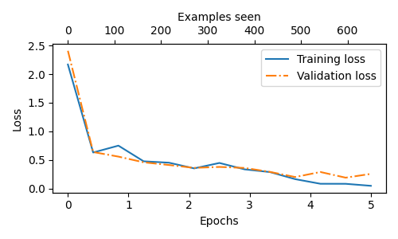
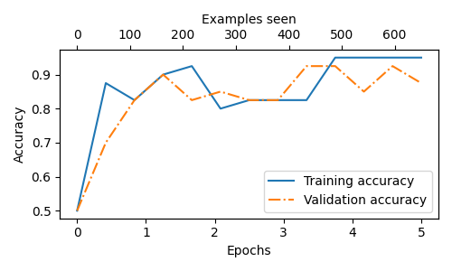
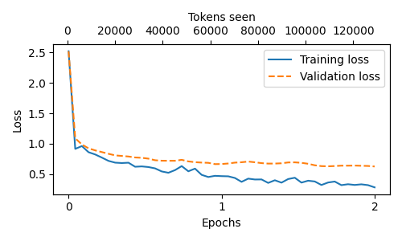

# Building a Large Language Model From Scratch

A from-scratch implementation of a GPT-style **large language model** in PyTorch — built to understand how LLMs actually work under the hood, not just how to call an API. The project covers the full LLM pipeline: implementing the transformer architecture, pretraining, loading real pretrained weights, and fine-tuning for downstream tasks (classification and instruction-following).

> **Credit:** This implementation follows Sebastian Raschka's *[Build a Large Language Model (From Scratch)](https://github.com/rasbt/LLMs-from-scratch)*. I built it to develop a genuine, line-by-line understanding of LLM internals, and extended it with my own fine-tuning experiments and analysis.

---

## What's implemented

Every component below was coded from the ground up in PyTorch — no high-level LLM library shortcuts for the core model:

- **Multi-head self-attention** with causal masking and scaled dot-product attention
- **Transformer blocks** with LayerNorm, GELU feedforward layers, residual connections, and dropout
- **Full LLM architecture** — token + positional embeddings through the output head
- **Pretraining loop** on raw text, with train/validation loss tracking and temperature + top-k sampling
- **Loading real pretrained weights** (GPT-2, 124M and 355M) into the custom architecture — including the non-trivial mapping of the fused QKV matrix into separate query/key/value projections
- **Classification fine-tuning** — transfer learning into an SMS spam detector
- **Instruction fine-tuning** — adapting the model to follow instructions, the same alignment step behind modern chat assistants

---

## Result 1: Spam classification (transfer learning)

Starting from the pretrained weights, I froze the backbone, replaced the output head with a 2-class classifier, and fine-tuned only the final transformer block + final LayerNorm + classification head.

| Metric | Accuracy |
|--------|----------|
| Training | 95.96% |
| Validation | 97.32% |
| **Test (held-out)** | **95.67%** |

- **Before fine-tuning:** 50.0% (random)
- **After fine-tuning:** 95.67% on held-out test data
- **Training time:** 1.6 minutes
- **Hardware:** NVIDIA RTX 2050 (4GB VRAM), ASUS TUF Gaming A15 laptop

Loss falls from ~2.4 to near zero; accuracy climbs from 50% (random) to ~96%, with training and validation tracking closely — a healthy, low-overfitting fit.

---

## Result 2: Instruction fine-tuning

Using the 355M-parameter model, I instruction-tuned on an instruction/response dataset so the model learns to follow commands and stop cleanly. Training loss dropped from ~2.5 to ~0.3 over 2 epochs (~21 minutes on the same 4GB GPU).

Sample outputs:

| Instruction | Model response |
|-------------|----------------|
| Rewrite the sentence using a simile: "The car is very fast." | "The car is as fast as a bullet." |
| Name the author of 'Pride and Prejudice'. | "The author of 'Pride and Prejudice' is Jane Austen." |

The model handles simpler instructions well and shows the expected fragility of a small model on some factual-recall prompts — a limitation that larger models and retrieval-augmented generation (RAG) are designed to address.

---

## Result 3: Model size comparison (124M vs 355M)

To see the effect of scale directly, I ran the same prompts through both the 124M and 355M pretrained models. The larger model produces more coherent, on-topic continuations that hold a thread for longer:

**Prompt: "The future of artificial intelligence is"**
- **124M:** "...uncertain, as AI has made a name for itself but it still has plenty of work to do..."
- **355M:** "...all about learning. When we learn more about the world around us, and how we interact with each other, we learn to make better decisions..."

**Prompt: "The most important lesson I learned was"**
- **124M:** "...if you're going to make a living online and find yourself doing something, you're probably better off taking it for granted..."
- **355M:** "...if you are a successful entrepreneur, you need to write your own code instead of using other people's code..."

Across prompts, the 355M model stays more focused and grammatical — a small, hands-on illustration of how model scale improves output quality, holding architecture and decoding settings constant.

---

## Result 3: Model scaling comparison (124M vs 355M)

Running the same prompts through the 124M and 355M pretrained models shows how scale affects generation quality — same architecture, same settings, only parameter count differs.

**Prompt: "The future of artificial intelligence is..."**
- **124M:** "...uncertain, as AI has made a name for itself but it still has plenty of work to do."
- **355M:** "...all about learning. When we learn more about the world around us, and how we interact with each other, we learn to make better decisions."

**Prompt: "In a small town in the mountains,..."**
- **124M:** choppier, loses the thread quickly
- **355M:** sustains a coherent mini-narrative ("...several men known as the 'Mud Men' who carry out strange rituals...")

The larger model stays fluent and on-topic for longer — a small, hands-on illustration of why scale matters in language models.

---

## Repository structure

| File | What it does |
|------|--------------|
| `basic_gpt2_model.py` | Core model (attention, transformer blocks, the LLM) + pretraining with loss tracking |
| `load_gpt2_124M.py` / `load_gpt2_355M.py` | Load pretrained weights into the custom model |
| `gpt_download.py` | Downloads the pretrained checkpoints |
| `spam_classifier_model.py` | Classification fine-tuning (SMS spam detection) |
| `instruction_tuned_model.py` | Instruction fine-tuning |
| `compare_models.py` | Side-by-side generation comparison (124M vs 355M) |
| `compare_models.py` | Side-by-side generation comparison (124M vs 355M) |

---

## What I took away from building this

- **Attention is an information-routing mechanism.** Each token produces a query, key, and value; the query-key dot products decide how much each token attends to every other, and the softmax-weighted sum of values is how context gets mixed in. Building it by hand made the math concrete in a way reading never did.
- **Weight-loading is the real correctness test.** Mapping pretrained weights into my own layer naming - splitting the fused QKV matrix, transposing each projection, aligning every block - only produces coherent text if the architecture is exactly right. Watching it generate fluent text was proof the implementation was correct end to end.
- **Fine-tuning is efficient.** Training only the last block, final norm, and a new head - a small fraction of the parameters - reached ~96% accuracy in under two minutes on a 4GB GPU.
- **Working within hardware limits is part of the job.** A 4GB laptop GPU meant managing out-of-memory errors, per-batch padding, and matching model size to the task - the real constraints engineers face.

---

## Tech stack

PyTorch · tiktoken · NumPy · pandas · matplotlib

## Acknowledgements

Built following Sebastian Raschka's *Build a Large Language Model (From Scratch)*. Original course and code: https://github.com/rasbt/LLMs-from-scratch
